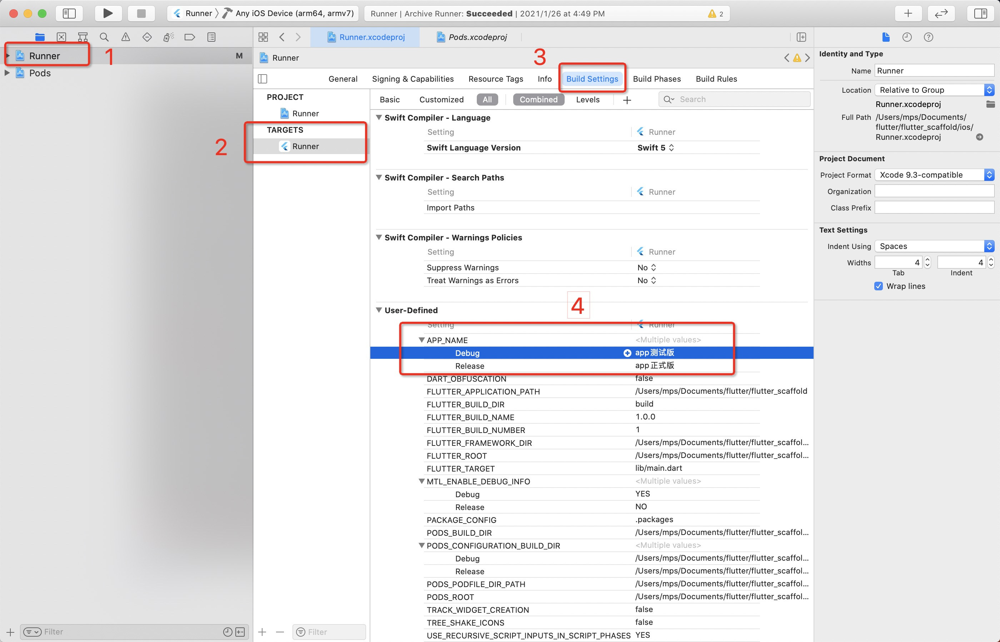
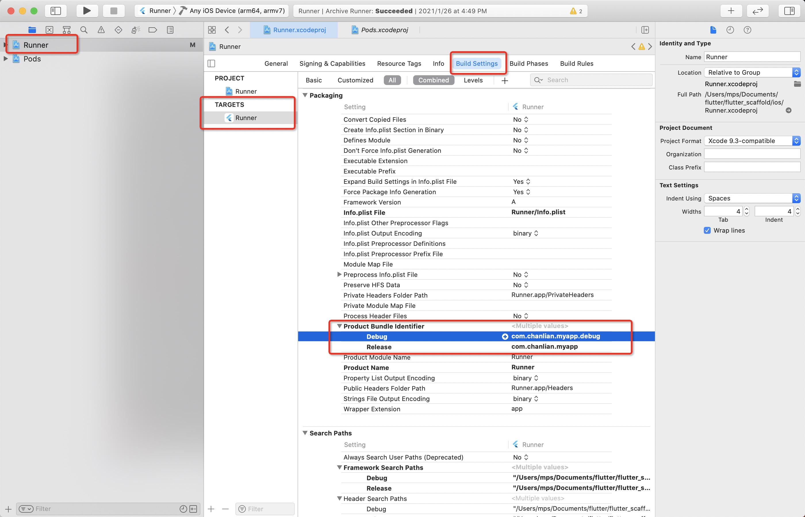

# 项目初始化配置

**图标的生成，可以使用第三方工具( https://appicon.co/ )，自动生成适配 android 和 iOS 的图标。**

### Android

#### 设置 app 名称

编辑文件 `android/app/build.gradle`, 在 buildTypes 字段下可以分别配置 debug 模式和 release 模式的 app 名称。

#### 设置 app 图标

编辑文件 `android/app/build.gradle`, 在 buildTypes 字段下可以分别配置 debug 模式和 release 模式的 app 图标名称。

然后替换图标文件，图标文件路径: `android/app/src/main/res/mipmap-*/*.png`。

默认情况下，需要 5 种不同分辨率的图标，以适配不同的手机像素密度。细节请看链接：https://developer.android.google.cn/training/multiscreen/screendensities#TaskProvideAltBmp。

#### 设置启动背景图

`android/app/src/main/res/drawable/launch_background.xml` 文件指定了启动图的名称。

修改 `android/app/src/main/res/mipmap-*/launch_bg.png` 文件，以更新启动图。

#### 设置 application ID

格式一般为：`com.<company>.<app-en-name>`（eg: com.chanlian.jsl）。

想好 ID 后，全局搜索替换脚手架默认的 application ID `com.chanlian.myapp` 为项目的 application ID。

然后修改 `MainActivity.kt` 文件的路径 `android/app/src/main/kotlin/com/chanlian/myapp/MainActivity.kt` 为项目 application ID 对应的路径 `android/app/src/main/kotlin/com/<company>/<app-en-name>/MainActivity.kt`。

#### 为 app 签名

```bash
# 使用下面的命令生成密钥库文件
keytool -genkey -v -keystore "./android/apk-sign.jks" -keyalg RSA -keysize 2048 -validity 10000 -alias key

# 然后修改 android/app/build.gradle 文件的 signingConfigs 字段
# 配置好指定的四个字段
```

### iOS

用 xcode 打开项目的 ios 子目录。

#### 设置 app 名称



#### 设置 app 图标

图标文件路径: `ios/Runner/Assets.xcassets/AppIcon.appiconset/*.png`。

#### 设置启动背景图

修改 `ios/Runner/Assets.xcassets/LaunchImage.imageset/LaunchImage*.png` 文件。

#### 设置 application ID


